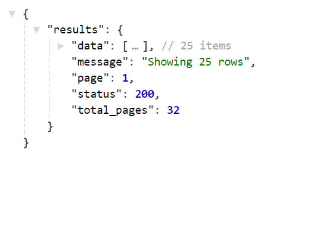
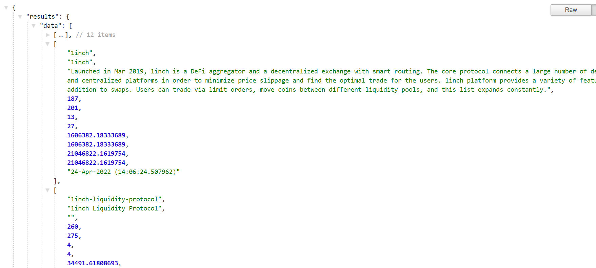
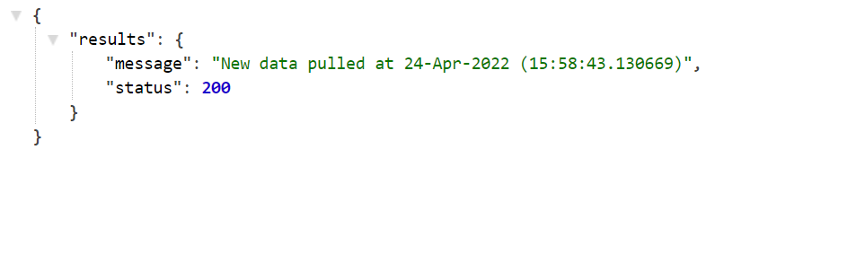
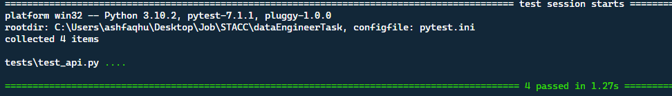

# ETL pipeline (basic) :smiley:

## :triangular_flag_on_post: Table of Contents

- [Introduction](#introduction)
- [RapidAPI checklist](#rapidapichecklist)
- [Installation](#installation)
- [Usage](#usage)
- [Testing](#testing)
- [Contributing](#contributing)
- [Author](#author)
- [License](#license)


## Introduction
This project is a simple ETL pipeline built for a data engineer job task. Basically, it allows you to pull data from [Coinpaprika RapidAPI](https://rapidapi.com/lbraciszewski/api/coinpaprika1/) and store it in a PostgreSQL database. A RESTful API is also included to serve data stored in the DB and also allows to pull off fresh data.

## RapidAPI checklist

You have to have an account for API keys. So please [SignUp](https://rapidapi.com/auth/sign-up) if you don't have an account or [SignIn](https://rapidapi.com/auth/login).

- Go to [Cpinpaprika](https://rapidapi.com/lbraciszewski/api/coinpaprika1/) playground
- We have used the **Exchanges** endpoint for this project. So, click on it 
- You'll see the details with **required information needed** for our solution


## Installation :computer:
Follow these steps:

### 1. Clone the project 

```bash
git clone git@github.com:ashfaqshuvo007/data_engineering_task.git
```
### 2. DB Setup (Postgres) 
- login to Postgres
Open your terminal and type the following command
```bash
psql -U userName
```
Enter your **password** when prompted.
- Create a new Database
```bash
CREATE DATABASE myDatabase WITH ENCODING 'UTF8' LC_COLLATE='English_United Kingdom' LC_CTYPE='English_United Kingdom';
```
- Create a new User
```bash
CREATE USER user_name WITH ENCRYPTED PASSWORD 'mypassword';
```
- Grant all privileges to the user for the new database
```bash
GRANT ALL PRIVILEGES on DATABASE myDatabase to user_name;
```


### 3. Create Env file
```bash
sudo touch .env
```
Copy the contents of the **.env.example** file onto new **.env** file

```
API_URL = "https://coinpaprika1.p.rapidapi.com/exchanges"
API_HOST = "coinpaprika1.p.rapidapi.com" 
API_KEY = <your API key>  # put the key you get from rapid API

DB_HOST="localhost"
DB=<db_name> # your database name
DB_USER=<db_user> #your database user name
DB_PASSWORD=<db_password> #your database user password
```

### 4. Environment Setup
- Linux
```bash
sudo apt-get install python3-venv    # If needed
python3 -m venv venv
source .venv/bin/activate
pip install -r requirements.txt

```
- MacOS
```bash
python3 -m venv venv
source .venv/bin/activate
pip install -r requirements.txt
```
- Windows
```bash
python -m venv venv
venv\scripts\activate
pip install -r requirements.txt
```


## Usage

### 1. Pull data/import data and store it in the local database
- From the root folder ```cd``` into **src** folder and run **import_data.py** file
```bash
cd src
python import_data.py
```
- Refresh the Database table to see new Data from the api. 

### 2. Run Flask Application 
- Set **Flask_APP** environment_variable to run the application from the root folder.
 For Linux and macOS
```bash
export set FLASK_APP=src/app.py
```
 For Windows
```bash
set FLASK_APP=src/app.py
```
- Use the following command to run the application
```bash
python -m flask run
```
You'll see the following in the terminal:
``` 
* Serving Flask app 'src/app.py' (lazy loading)
* Environment: production
   Use a production WSGI server instead.
 * Debug mode: on
 * Running on http://127.0.0.1:5000 (Press CTRL+C to quit)
```
This means your flask app is running successfully. Go to ```http://127.0.0.1:5000``` on a browser and you'll see:
- Results 
    1.  Index Route: 


    2. All Data with Pagination. Go to ```http://127.0.0.1:5000/show_data```



    3. Data on a specific page number. Go to ```http://127.0.0.1:5000/show_data/<page>```



    4. New Data pulled using API. Go to ```http://127.0.0.1:5000/load_data```



## Testing
I am using **pytest** to test this application. To make changes to any configuration, use the ```pytest.ini``` file.
- There is only one test implemented 
It is to use the functional testing of the rest api endpoints. To test the enpoints, run: 
```bash
python -m pytest
``` 
- A successful run of **tests** should yield:


## Contributing
Pull requests are welcome. For major changes, please open an issue first to discuss what you would like to change.
Please make sure to update tests as appropriate.

## Author

**Ashfaq Hussain Ahmed**
- [LinkedIn](https://www.linkedin.com/in/ashfaqhahmed/)

## License
[MIT](https://choosealicense.com/licenses/mit/)